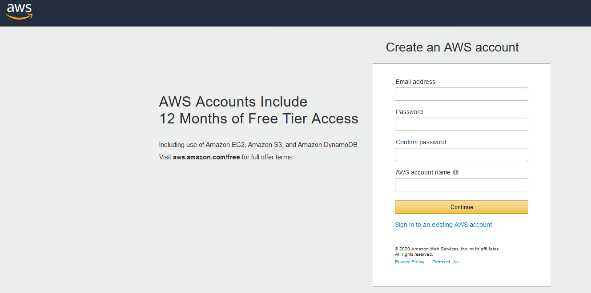
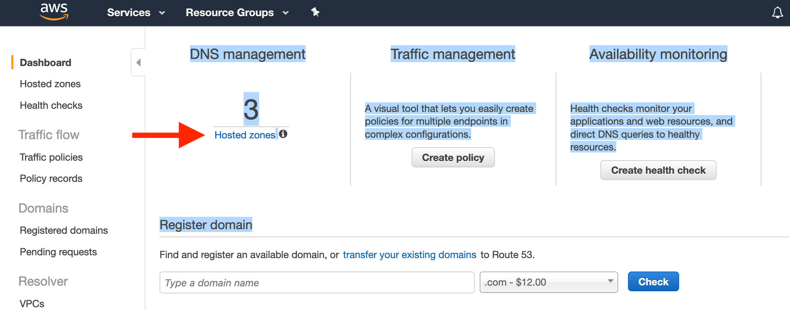

### How to Register a Domain name and assign an IP to the Domain Name Server (DNS) using AWS.

#### Make an AWS account for yourself.
(From Amazon AWS API Version 2013-04-01)

"When you sign up for AWS, your AWS account is automatically signed up for all services in AWS,
including Amazon Route 53. You are charged only for the services that you use.
If you don't have an AWS
account, use the following procedure to create one.
To create an AWS account
1. Open https://portal.aws.amazon.com/billing/signup.

2. Follow the online instructions.
*(Note - you should register for a personal account, basic plan, unless you are doing this for a business - and I have no experience with how that changes these instructions.)*

Part of the sign-up procedure involves receiving a phone call and entering a verification code.

#### Access the console

To access the AWS Management Console go to (https://aws.amazon.com/console/).  You probably want to bookmark this link, so you can get back to it.  


When you go for the first time, you will need to provide an email address and a password. Login as Root.
This combination of your email address and password is called your root identity or root account credentials. From the console, you can access the services, Route 53 (the AWS domain name registrar) and EC2 (where you launch instances).

### Register a domain name (with Amazon Route 53).

#### Estimated cost

- *There's an annual fee to register a domain, ranging from $9 to several hundred dollars, depending on the top-level domain, such as .com. For more information, see [Route 53 Pricing](https://d32ze2gidvkk54.cloudfront.net/Amazon_Route_53_Domain_Registration_Pricing_20140731.pdf) for Domain Registration. This fee is not refundable.* (I recommend domain names ending in .net, they only cost $11 for the first year, are generally recognizable, and register quickly. Donaim names ending in unusual prefixes, _e.g._  ".be" names are sometimes cheaper, but can take much longer to process.)

- *When you register a domain, AWS automatically creates a hosted zone that has the same name as the domain. You use the hosted zone to specify where you want Route 53 to route traffic for your domain using an IP address (which you will get later). The fee for a hosted zone is $0.50 per month.*"

#### Steps
Click on this link [https://console.aws.amazon.com/route53/home](https://console.aws.amazon.com/route53/home)


_(Screen shot of what you will see as you follow steps below.  I recommend using the arrow 1. to choose .net instead of .com)_

and follow the steps below:


It is best to leave privacy enabled.

Disable "Automatic renewal of your domain" to prevent yearly charges. The option is right above the Terms and conditions. You can always change it to auto renew later.


After completing, you will see the screen below:


Before proceeding further, you need to wait until you receive an e-mail saying the registration is complete and a hosted zone has been setup.  Here is a sample:

> Hi,

>We have successfully registered "your domain name". We also created a hosted zone for your domain. This hosted zone is where you store information about how to route traffic for your domain, for example, to an Amazon EC2 instance or a CloudFront distribution. To learn how to add resource record sets to your hosted zone, see Working with Resource Record Sets.

>If you did not request this change, please contact Amazon Web Services Customer Support immediately.

>Amazon Route 53

Receiving the registration e-mail usually takes 20 minutes with .net domain names but can take much longer sometimes (3 days).  If instead of getting a "successfully registered e-mail", you get an e-mail stating there are issues with your domain registration, follow the instructions in the e-mail to clear up the issues.  You might need to verify your e-mail, etc.  There is no point in proceeding until your domain is successfully registered and your hosted zone has been created for your domain.

After that is complete:


- Click on "Hosted zones" is the left column or at the red arrow.



- Click the radio button next to the name of the hosted zone that matches the name of the domain that you want to route traffic for.


- Click **Go to Record Sets** (see red ellipse above).


- Choose **Create Record Set** (see red ellipse above)
 - Specify the following values:
 - **Name** – leave the box blank. The default value is the name of the hosted zone.
 - **Type** - Choose **A – IPv4 address**.
 - **TTL (Seconds)** (TTL stands for "Time To Live") - Accept the default value of **300**.
 - **Value** - Enter the IP address of your router under Allocate Elastic ID.
 - **Routing Policy** – Accept the default, **Simple**.
 - Click **Create** button at the bottom.


Use

 ```
 nslookup domainname
 ```

 and make sure your IP has propagated to it.  That typically takes a few minutes, but again, can take a few days if you are checking DNS servers outside the U.S.

 Once ```nslookup domainnam``` returns the IP of your router, you are ready to proceed.
