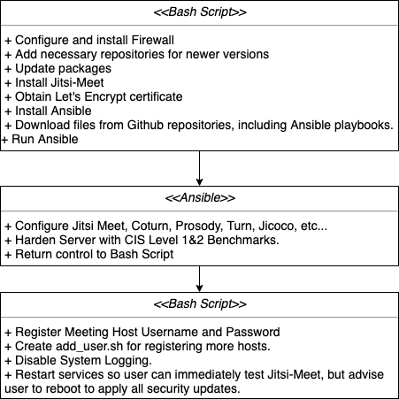

# Design Document 1.0
##### Rev 0.1 - First draft May 27, 2020.
##### Rev 0.2 - Update Testing and Maintenance. May 28, 2020.
##### Rev 1.0 - Begin Implementation based on this, update as needed. May 29, 2020
##### Rev 2.0 - At Implementation based on Tag v0.11 on master. July 10, 2020
##### Rev 3.0 - Move to Ubuntu 20.04, drop standalone support.  December 31, 2020

## 1 Design Considerations

### 1.1 Assumptions

This document will provide the design for enabling the setting up a private and secure dedicated Jitsi Meet server for a video conference for a few people, either in the cloud or stand-alone, appropriate for utilization by a small organization or individual. The project will run in a public Github repository and invite comments and contributions from the open source community. Secondarily to privacy and security, ease of use will also be a design goal.

The user is assumed to be a technically savvy individual with some familiarity with linux, but lacking any experience with the required individual components (setting up a server, firewalls, DNS domain registration, etc.).

The design may utilize code from various open source repositories on Github provided by individuals. The continued availability and maintenance of this code cannot be guaranteed by this project.

### 1.2 Constraints

For the cloud solution, cost will be the primary constraint, but it is expected that cost will be very modest, approximately $50 for a year.

### 1.3 System Environment

This project will be developed for an Ubuntu 20.04 server.  A cloud solution (AWS or similar)  will be supported.

The automation is independent of cloud provider and hardware.  However, the step by step instructions will need to be modified if you choose a different cloud provider.

## 2 Architectural Design

### 2.1 Components

A Bash script will be utilized to run the installation process. The firewall will be configured and activated. The script will install Jitsi Meet, Let's Encrypt and Ansible (https://www.ansible.com/), with all needed package dependencies.  Ansible is a popular open source package for the configuration and maintenance of servers.  Ansible will be used to harden the software using recommendations from the CIS Benchmark (https://www.cisecurity.org/cis-hardened-images/), however not all recommendations of CIS will be used.  In particular, logging will be disabled to increase privacy, and Jitsi Meet uses coturn which has telnet as a package dependence. Ansible will be used to configure Jitsi Meet and related components, nginx, prosody, coturn, etc.

Note: With V3.0, using pre-image of CIS L1.  Not currently implementing any of L2.

### 2.2 Component Diagram

## 3 User Interface Design

Detailed instructions will be provided for those steps that are not amendable to automation, such as obtaining a domain name, IP address, and similar.

Once the user is in the server, the user interface will be the command line.  Automation will be used to minimize the commands and the complexity of those commands that the user will need to enter.

## 4 Maintenance
Automatic security updates, with appropriate repositories will be enabled.
