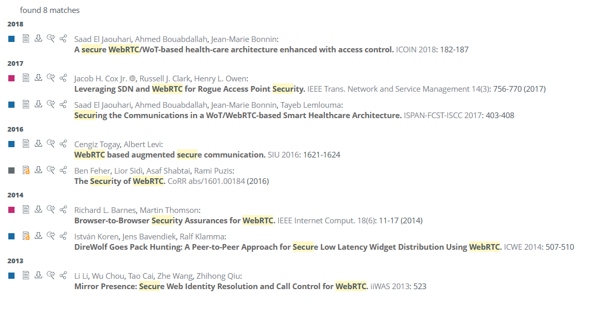

# Research Summary- CS6727
Version 1.0 - June 17, 2020  
**Author**: Kevin Wilson, PhD  
## Methodology

1. Perform search for relevant articles on [dblp computer science bibliography](https://dblp.uni-trier.de/) within the last 10 years. "*The dblp computer science bibliography provides open bibliographic information on major computer science journals and proceedings.*"

2. Perform search for relevant articles on the [Association of Computing Machinery (ACM) Digital Library](https://dl.acm.org/) within the last 10 years on the "The ACM Guide to Computing Literature" resource.

3. Examine CVE's.

4. Research Privacy policies of Commercial Videoconferencing solutions.  Privacy policies are legally binding on companies and are an important source for consumers to understand what data a company collects.

### dblp Computer Science Bibliography Search

The searches were performed on June 17, 2020, limiting results to publications since January 1, 2010.

With the search term "WebRTC", hundreds of results were returned, so the search was limited to "WebRTC and Secur" (capturing both "security" and "secure"), which returned 8 relevant papers and "WebRTC and Priva" (capturing both "privacy" and "private")  which returned four papers.  All twelve papers were evaluated for relevance and the five most relevant works are summarized below.

With the search term "videoconferenc" (capturing videoconferce and videoconferencing), 40 results were returned for this period.  Given the small number or results, the titles were manually examined for sources which might contain information relevant for security.  Papers of possible relevance had their abstract read, and if any mention of security was in the abstract, or it described a videoconferencing solution, the two most relevant works are summarized below.

Search terms "Zoom" and "Jitsi" returned no relevant results.  

A complete list of returned results for the above search terms is shown in **Appendix A**.  

##### Summary of Relevant Papers.

* Andreas Reiter, Alexander Marsalek:*WebRTC: your privacy is at risk.* SAC 2017: 664-669.  

Highly relevant paper describing four attacks with mitigations.  The first attack discussed is you have to trust your server which establishes the connections - which is the entire point for this project.  The server operator can easily put a man-in-the-middle attack which can be difficult/impossible to detect.  

The second attack is the exposure of your local IP by your browser, even behind a VPN, which can leak your geolocation.  However, this has since been mitigated by various browser and/or VPN services. You can test your VPN/Browser with various web sites and ensure it does not expose your local IP. Using a VPN can degrade your quality of service (QoS), due to increased round-trip time (RTT) which affects audio, and decreased bandwidth, which affects video.  If you feel you can trust both the participants and server, and you do not mind the exposure of your metadata (your ISP will know you are participating in a videoconference using a certain server host), you may choose better QoS over privacy.

Third, is related to attack number two - and it has to do with exploring your local IP with scanning using a javascript to determine your device and network.  However, if you have mitigated attack number two, this is not relevant, and the same caveats apply.

Finally, it talks about a theoretical denial of service attack (DOS attack), which is not particularly practical, as it requires a large number of participants and DOS attacks are outside of the scope of this project.
* Alessandro Amirante, Tobia Castaldi, Alexandre Gouaillard, Lorenzo Miniero, Sergio Garcia Murillo, Simon Pietro Romano:*Bringing privacy to the Janus WebRTC server: The PERC way.* IPTComm 2017: 1-8.  

This paper considers the opensource WebRTC server Janus.  Janus provides a service, but has no features built in *per se*, those are to be provided by browser pluggins, so it is not useable as a videoconferencing solution (it is meant as the backend of a solution).  The most relevant part of this paper is the description of the PERC standard, which is being developed to allow for End-to-End (E2E) encryption of video with WebRTC.  This, in theory, allows for an untrusted server as the video stream is encrypted at the server (I highly suspect we will find it allows for a *less trusted* server, vs. *untrusted*...).  Jitsi has the PERC standard in prototype, and this will be an important feature when implemented.  At this writing, only the Chrome browser supports it.

* Ben Feher, Lior Sidi, Asaf Shabtai, Rami Puzis: *The Security of WebRTC.* CoRR abs/1601.00184 (2016).  

This is a relevant, but dated paper.  What is most relevant, is that it points out that while WebRTC is well designed the security is heavily dependent on the implementation in the client browser and security of the server (which this project is attempting to address).  These two endpoints are the primary weakness of the protocol.  The specific exploits discussed have, from what I can determine from the CVE database, been patched by the latest browsers (*e.g.* Chrome and Firefox).

* Richard L. Barnes, Martin Thomson: *Browser-to-Browser Security Assurances for WebRTC.* IEEE Internet Comput. 18(6): 11-17 (2014).*

A description of the design of WebRTC and how it provides its security assurances.

* Alfonso Sandoval Rosas, José Luis Alejos Martínez: *Videoconference System Based on WebRTC With Access to the PSTN.* CLEI Selected Papers 2016: 105-121

This paper describes a prototype development integrating Videoconference with standard telephone using WebRTC  (Jitsi also uses WebRTC) called *Rendez-Vous*.  However, searches (DuckDuckGo) on further development *Rendez-Vous* of this solution turned up no relevant English language results.
The paper was interested in Quality of Service and had no relevant security information.

* Alexandre G. Ciancio, José F. L. de Oliveira, Cassius D. Estrada, Eduardo A. B. da Silva, Amir Said: *Impact of encoding configurations on the perceived quality of high definition videoconference sequences.* ISCAS 2012: 1716-1719

This was a quality of service study comparing frame-rates, degree of compression, and image size.

### ACM Digital Library Search.

Relevant articles were searched for using the the [Association of Computing Machinery (ACM) Digital Library](https://dl.acm.org/) within the last 10 years on the "The ACM Guide to Computing Literature" resource. I used various combinations of "videoconference" and "videoconferencing" combined with "secure", "security", or "privacy".  However, nothing of relevance was found that had not previously been found with dblp searches.

### Examine CVE's

The CVE database was searched on June 17, 2020 for CVE's in 2019.  
Zoom had 14, Skype 6, Microsoft Teams 1, WEBex 44, Jitsi had 1, none were found for Google products (Google Meet and Duo had a lot of false positives due to common word and Duo password product, so it is possible a few were missed.).  However, Jitsi uses WebRTC which depends on browser support.  There were 15 CVE's on WebRTC, reflecting the many combinations browser and OS combinations.  Most recent CVE's have been reported on Google Chrome, vs. Firefox.  The Zoom and Jitsi CVE's have been fixed in current release, and the browsers actively patch CVE's.  

My belief is that the number of CVE's is primarily related to the popularity of the product, and secondarily related to the security of the product.   If companies leave CVE's open (which does not seem to be the case in these products), it is a significant security concern.  However, from what is found here, there is no clear indication that one product is more secure than another.

### Proprietary Software

All commercial videoconferencing solutions (except 8x8) are utilizing proprietary software.  This can be a particular issue when the software developers are in countries whose governments can command "backdoors", as is the case with Zoom as reported in the [Economist : Can Zoom be trusted with users’ secrets?](https://www.economist.com/business/2020/06/20/can-zoom-be-trusted-with-users-secrets) on June 20, 2020.

Proprietary software solutions restrict security and privacy evaluation and violate a fundamental principle for secure software design.

### Privacy policy evaluation.

On March 30, 2020, Consumer Reports evaluated the privacy policy of Zoom. From the [article](https://www.consumerreports.org/video-conferencing-services/zoom-teleconferencing-privacy-concerns/)

>Zoom's privacy policy is similar to many digital platforms', claiming the right to collect and store personal data, and share it with third parties such as advertisers.

>In Zoom's case, that extends to what the company calls customer content, or "the content contained in cloud recordings, and instant messages, files, whiteboards ... shared while using the service."

>Videos aren't off-limits, according to the document, and neither are transcripts that can be generated automatically, the documents you share on your screen, or the names of everyone on a call.

After the public outcry from this article, and another [article](https://www.vice.com/en_us/article/k7e599/zoom-ios-app-sends-data-to-facebook-even-if-you-dont-have-a-facebook-account) about sharing of the information with Facebook from Motherboard, Zoom made some improvements to its policy, but, as Schneier points out in this [blog](https://www.schneier.com/blog/archives/2020/04/security_and_pr_1.html)
> It's (*ed. the new Zoom Privacy Policy*) better than it was, but Zoom still collects a huge amount of data about you. And note that it considers its home pages "marketing websites," which means it's still using third-party trackers and surveillance based advertising.

On April 30, 2020, Consumer Reports evaluated the privacy policies of the other three big commercial videoconferencing providers: Webex from Cisco; Skype and Teams from Microsoft; and Meet, Duo, and Hangouts from Google.

The damning quote from the [article](https://www.consumerreports.org/video-conferencing-services/videoconferencing-privacy-issues-google-microsoft-webex/):

> "While there are differences among the privacy policies of the different platforms, on balance,
 the differences aren't enormous," says Bill Fitzgerald, a privacy researcher in Consumer Reports' Digital Lab who analyzed the documents. "And from a privacy point of view, none of these options are great."

> According to their privacy policies, all three companies can collect data while you're in a videoconference, combine it with information from data brokers and other sources to build consumer profiles, and potentially tap into the videos for purposes like training facial recognition systems.

## Conclusion

The privacy policy of the commercial providers, Zoom, Google Hangouts and Meet, Cisco WEBex and Microsoft Skype and Teams may be unacceptable to some individuals, as all the companies collect data on users which consumers may be unwilling to share.   Additionally, commercial providers may change their privacy policy and if the new policy is unacceptable, the customer incurs a disruption penalty of changing videoconference providers.
However, there is no convincing evidence that one videoconference solution is more secure than another.   It is not unexpected for vulnerabilities to be discovered in either proprietary or open-source solutions, but since the CVE database did not have open recent serious or critical vulnerabilities, patches to the vulnerabilities seem to be reasonably  prompt by all providers.  With whatever solution a consumer uses, they will need to keep their software updated.

## Appendix A, dlbp search
**Search term "WebRTC and Secur"**

**Search term "WebRTC and Priva"**

**Search term "videoconferenc"**

