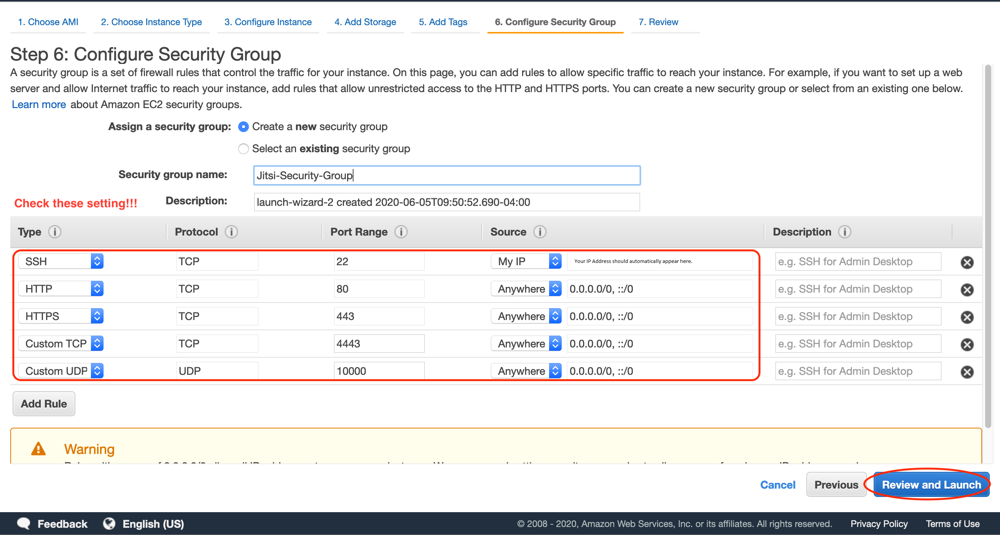

# Hosting a Private/Secure Jitsi-Meet Server in the cloud (AWS)

This is step by step instructions of how to host a security hardened instance of Jitsi-Meet in the cloud. It is specific to AWS, but should be modifiable to other cloud providers. Expect to pay a modest amount, less than $15 for testing for two to three participants. To run your own instance for a dozen or so participants will cost an additional about $0.10 an hour. You should expect to spend about an hour each, in two separate sittings to follow these instructions.

## High level overview of the process

### First Sitting

1. Make an AWS account for yourself.
2. Register a domain name for your site. (Note, the domain can take up to three days for the registration to go through, but my experience has been less than 30 minutes for a .net domain. You get an e-mail when the domain is registered.) You have to wait for this to be successful, before proceeding in the process.

### Second Sitting
3. Log onto AWS (if you logged out while waiting for the domain registration).
4. Make a private/public key pair which you will need to log onto your instance.
5. Begin the launch the of an instance (your server in the cloud).
6. Set up the Amazon firewall (*aka* Security Group).
7. Finish launching your instance.
8. Allocate an Elastic IP for your instance.
9. Set the domain name service (DNS) to associate your domain name with this IP.
10. Log into your instance.
11. Run three commands on the command line.
12. Answer a few prompts.
13. Add additional meeting hosts and their passwords. Only these users can host meetings on your server, using the username and password you set.
14. Restart your server to apply security patches.
15. Use your Jitsi Server to host video-conferences!
16. Expand to more users if necessary

 **Troubleshooting at the end, if you get really stuck**

## First sitting - account and domain name

### 1. Make an AWS account for yourself.
(From Amazon AWS API Version 2013-04-01)

"When you sign up for AWS, your AWS account is automatically signed up for all services in AWS,
including Amazon Route 53. You are charged only for the services that you use.
If you don't have an AWS
account, use the following procedure to create one.
To create an AWS account
1. Open https://portal.aws.amazon.com/billing/signup.
2. Follow the online instructions.
*(Note - you should register for a personal account, basic plan, unless you are doing this for a business - and I have no experience with how that changes these instructions.)*

Part of the sign-up procedure involves receiving a phone call and entering a verification code.

#### Access the console

To access the AWS Management Console go to (https://aws.amazon.com/console/).  You probably want to bookmark this link, so you can get back to it.  When you go for the first time, you will need to provide an email address and a password. Login as Root.
This combination of your email address and password is called your root identity or root account credentials. From the console, you can access the services, Route 53 (the AWS domain name registrar) and EC2 (where you launch instances).

### 2. Register a domain name (with Amazon Route 53).

#### Estimated cost

- *There's an annual fee to register a domain, ranging from $9 to several hundred dollars, depending on the top-level domain, such as .com. For more information, see [Route 53 Pricing](https://d32ze2gidvkk54.cloudfront.net/Amazon_Route_53_Domain_Registration_Pricing_20140731.pdf) for Domain Registration. This fee is not refundable.* (I recommend domain names ending in .net, they only cost $11 for the first year, are generally recognizable, and register quickly. Donaim names ending in unusual prefixes, _e.g._  ".be" names are sometimes cheaper, but can take much longer to process.)

- *When you register a domain, AWS automatically creates a hosted zone that has the same name as the domain. You use the hosted zone to specify where you want Route 53 to route traffic for your domain using an IP address (which you will get later). The fee for a hosted zone is $0.50 per month.*"

#### Steps
Go to [https://console.aws.amazon.com/route53/home](https://console.aws.amazon.com/route53/home) and follow the steps below:


It is best to leave privacy enabled.

Disable "Automatic renewal of your domain" to prevent yearly charges. The option is right above the Terms and conditions. You can always change it to auto renew later.


After completing, you will see the screen below:


After you get an e-mail that your domain was successfully registered, you can proceed. This usually takes 20 minutes with .net domain names but can take much longer (3 days).  If instead of getting a "successfully registered e-mail", you get an e-mail stating there are issues with your domain registration, follow the instructions in the e-mail to clear up the issues.  You might need to verify your e-mail, etc.  There is no point in proceeding until your domain is successfully registered.

## Second sitting - Set up your Amazon EC2 instance as a Jitsi server

_Adapted from https://aws.amazon.com/de/blogs/opensource/getting-started-with-jitsi-an-open-source-web-conferencing-solution/_

### 3. Log onto AWS (if you logged out while waiting for the domain registration).

Logon to the AWS Console (https://aws.amazon.com/console/)). Under services, click on EC2. _(If you have a hard time finding EC2, you can find it by clicking on the Services drop down button, top left of page and look under "Compute")_. After clicking on EC2, on the left hand side, scroll down until you see "Key Pairs" – click on it, and then follow below.

### 4. Make a SSH private/public keypair

Create a key pair that you will use to SSH into your Jitsi server. A "key" is just a special file.  You will be creating a public/private key pair, and saving the private part of your key to your computer and putting the public part of the key into the Jitsi Server you create in a much later step.

Click on Create Key Pairs (Right corner, see orange box below). *(Note, if you have trouble with this step or below, it is OK to Create another key pair, the first few are free, with a different name, e.g. JitsiKey2 instead of JitsiKey.  Then just use JitsiKey2 everywhere below.)*


On the screen that pops up (see below), you must select the file type. Select the **.pem** format (even if you use Windows).
Key pairs are regional. You need to select a region close to your users, for best performance of Jitsi. The region can be changed in the upper right corner, between the search box and the support button (see red ellipse in diagram, I chose Ohio, but you should choose the region close to you). ***NB: Whenever you go to EC2, for keypairs, elastic IPs, or instances, you must be in the region you choose here.  If you do not see your instance, etc... make sure you are in the correct region, you will always find the region displayed in the top right as shown.***


After selecting the most appropriate region and the correct File format (pem), enter "JitsiKey" in the box where it says "enter key pair name" and click on the **Create Key Pair** button. Save the file (*aka JitsiKey.pem*) that pops up on your machine to your Documents folder. If you are not asked where to save the file (key), your browser probably put it in your downloads folder.  Click on the download icon  and the magnifying glass which appears next to the name of the file, and move the file to the Documents folder.

You will need this file (JitsiKey.pem) to log in to the instance you are going to create.  (If you are familiar with key pairs and SSH, you can deviate from these instructions and give the key pair a different name, folder, etc..  If you have never done this, follow the instructions _**exactly**_).

#### MAC/Linux only - instructions to change the permission of the key.

On MAC/Linux systems you will need to change the file permissions of the key before SSH will allow you to use it. Windows users can skip this step.


Open a terminal window. On a Mac, you can find this under Launch Pad in the Other folder.
At the prompt, type
```
cd Documents
```
to go to the folder where you saved your key (JitsiKey.pem).  You can check that you are in the correct folder, and your key is there by typing _(Note, you can use Tab key to autocomplete the name "JitsiKey.pem" once you have typed enough letters for there to be only one choice left.)_

```
ls -l JitsiKey.pem
```
Make sure you see your file. Then type
```
chmod 400 JitsiKey.pem
```

Check that you made the change by typing
```
ls -l JitsiKey.pem
```
Now, on the far left in front of the key name you should see ```-r----------```. If so, you were successful and can move on. Leave the terminal open though, you will need it later.

### 5. Begin to launch instance.

Click on Instances (the one in smaller print, directly above Instance Types) on the left column. You will see "Launch Instance" as a big blue button.  After clicking on the big blue "Launch Instance", in the search box type **Ubuntu** and hit return. Click **Select** on the Ubuntu 18.04 LTS row and make sure the radio button is selected for 64-bit (x86), as Jitsi does not work with Arm (see below for example).


On the next screen, shown below,


Choose t2.micro – if you are doing this for the first time, which is free for 750 hours of use. This will allow conferences of a few people to test. For use with more people, you will need to pay for a larger instance (eg. T3.large), but you can easily do this later. Guidance on the size of instance you will need and cost is at the end of the document.

Now skip forward to step 6 of the wizard by clicking on step 6, marked by the red arrow in the figure, to set up the firewall. (Amazon's default selections for steps 3-5 are fine, but you can review them if you want.)


### 6. Set up the Amazon firewall (*aka* Security Group).

- Leave the "Create a new Security group radio button selected".

- Change the security group name to **Jitsi-Security-Group** or another name you will remember.

- **VERY IMPORTANT:** Change the SSH Source to your IP address, by clicking the selection custom and choosing "My IP". (This likely will not work properly if you are behind a VPN (Virtual Private Network).  Drop your VPN for this step only, and steps 10-12 below.  You can use your VPN for all other steps, as well as when you use Jitsi, just not when you log into your instance and when you set up your firewall.).

*If you want to stay behind your VPN– you will have to set up a bastion host- No instructions here for that...,   If you do not know what a VPN is, you are likely not using a VPN.  If you want to test it, go to https://whatismyipaddress.com/  If that site reports your address, you are not behind a VPN.  If it reports you are somewhere else (like a different town or state), you are behind a VPN).*


- Click Add rule and change the type to HTTP and the source to **Anywhere**. (note, HTTP requests will be redirected to HTTPS)
- Click Add rule and change the type to HTTPS and the source to **Anywhere**.
- Click Add rule and change the type to "Custom TCP", and put 4443 in the Port Range box, and set the source to **Anywhere.** (Ignore the warning, you want users from Anywhere to connect to you meeting, you will password protect your meetings in the Jitsi setup).
- Click Add rule and change the type to "Custom UDP", and put 10000 in the Port Range box and set the source to **Anywhere.**

Your screen should look like below:


### 7. Finish launching your instance.

- Click on **Next: Review and Launch.**
- Click on **Launch.**
- On the pop-up list, select the ssh key you created (JitsiKey) and tick the acknowledge.
- Click on **Launch Instance** to kick off the creation, and on the following screen click on **View Instances** (bottom right corner).

For this to provision and set up will take a few minutes. On the console, once your instance changes to status checks RUNNING and 2/2 checks passed, you have completed the launch of your instance. While waiting, click the pencil that appears when you hover on the right side of the empty Name box,

and give your Instance a name (anything is OK, but it is easier to remember than an ID. Don't forget to hit the check mark to save!).

Your screen should look like this when you are ready to proceed.


### 8. Allocate an Elastic IP for your instance.

To ensure that your instance keeps its IP during restarts, configure an Elastic IP. From the EC2 console:
- Select **ELASTIC IPs** (on the left, scroll down it is under NETWORK & SECURITY).
- Click on the **ALLOCATE ELASTIC IP ADDRESS.**
- Select the default (Amazon pool of IPv4 addresses) and click on **ALLOCATE.**
- From the **ACTIONS** pull down, select **ASSOCIATE ELASTIC IP ADDRESS.**
- In the box that comes up, *note down* the **Elastic IP Address**, which will be needed when you configure your DNS.
- In the search box under **INSTANCE**, click and find your instance NAME (or INSTANCE ID if you did not give it a name) and select it.
- In the **Private IP address**, click in the box and select the default. You must fill in the Instance box before this is available.
- Click the "Allow this Elastic IP address to be reassociated" checkbox.
- Then click **ASSOCIATE**.

Your instance now has an elastic IP associated with it. Holding onto this elastic IP when your instance is not running costs (currently $0.005/hour, or $0.12/day). Typically, holding onto the elastic IP is cheaper than keeping your instance running. You can release your elastic IP, but then you will need to reset up your DNS….

### 9. Set the domain name service (DNS) to associate your domain name with this IP.

You will need to configure a DNS entry for the new host you have provisioned, so that it can be used to generate the SSL certificates as part of the installation process.
- Click on Services at the top of the page, and in the search bar type ```Route 53``` and in the bar that appears choose Route 53 (see the red arrow).


- Under DNS management, click on the blue **Hosted zones**.


- Click the radio button next to the name of the hosted zone that matches the name of the domain that you want to route traffic for.


- Choose **Go to Record Sets** (see red ellipse above).


- Choose **Create Record Set** (see red ellipse above)
 - Specify the following values:
 - **Name** – leave the box blank. The default value is the name of the hosted zone.
 - **Type** - Choose **A – IPv4 address**.
 - **TTL (Seconds)** (TTL stands for "Time To Live") - Accept the default value of **300**.
 - **Value** - Enter the IP address that you wrote down in step 5 under Allocate Elastic ID. (If you lost the value, go back to the EC2 dashboard, and click on Running Instances and scroll to the right until you see Public IPv4 address).
 - **Routing Policy** – Accept the default, **Simple**.
 - Click **Create** button at the bottom.

Changes generally propagate to all Route 53 servers within 60 seconds. When propagation is done, you will be able to route traffic to your EC2 instance by using the name of the record that you created.  So, wait a minute - get up and stretch!

Now go back to your terminal window (PowerShell on Windows) and type ```nslookup domainname``` where domainname is the DNS name you have registered (ex. ```nslookup example.net```). When it returns the IP address you entered for **Value**, you are ready to proceed. ***Do not proceed until this is the case.***   (Note, if you are doing this behind a VPN that takes you to another country than your AWS instance is in, it may take considerably longer for nslookup to report the correct IP address).

### 10. Log into your instance.

Go to your terminal window and you need to be in the same folder (*aka* directory) as your key.

*On Windows, get a terminal window by typing powershell in the search bar and opening the PowerShell app.  To see which directory (aka folder) you are in, type ```pwd```   To see what files and directories are in your directory, type ```ls```  To change your directory, type ```cd .\Documents```*

At your terminal window (PowerShell on Windows) type:
```
ssh -i JitsiKey.pem ubuntu@{your-domain-name}
```
Where the JitsiKey.pem is the key you created and {your-domain-name} is the domain name you registered (ex. ```ssh -i aws_key.pem ubuntu@example.net```). Type **yes** to the question about whether you are sure you want to continue connecting.

If you get a hang during this operation, you should check both that you typed the domain name correctly, that you set up the security group in step 6 properly, that your instance is running (you can check that at AWS) and that you are not behind a VPN.

You should get a prompt that looks like (the IP shown will not be the Elastic IP you configured in step 8):
```
[ubuntu@ip-somenumbers:~$
```
Optional: Use your mouse to drag the sides of this window with ```ubuntu@ip-somenumbers:~$``` and make it bigger, so it will be easier to see for your work below.


### 11. Run three commands on the command line.

Copy/paste or type out the following commands one at a time (hit Enter and wait for each one to finish before running the next one)
```
curl -o Install.sh https://raw.githubusercontent.com/fgamgee/Jitsi-Meet-Secure-Server/master/code/Install.sh
chmod +x Install.sh
sudo ./Install.sh
```
### 12. Answer a few prompts.
_If you make a mistake anywhere, it's very quick and easy to start over by setting up a new instance. See below for how to set up a new instance._

Once you start running the last command, a lot of text will start scrolling past on the screen. You will get a blue or pink screen – with a red **<Yes\>** - press enter – **TWICE**.

More text will scroll – occasionally it will stop scrolling for a minute – be patient. If everything is going well you will get another bright pink or blue screen. **Type in your domain name and press enter.**

Almost immediately, another pink or blue screen will say **"Generate a new self-signed certificate …."** Press enter. We will change this to a real certificate very soon.

More text…. Be patient. Next you will get a prompt:
```
Enter your email and press [ENTER]:
```
Enter the email address associated with your domain name and press enter. This is sent to Let's Encrypt to obtain a security certificate.

Then lots more text. You may see a couple of  ```[WARNING]``` messages but that is normal. The Init AIDE task will also take several minutes, so be patient if it appears to hang.
Eventually you will see the message:
```
Username for host of meeting:
```
You need to create a username for someone to host a meeting.  Type the username and press ENTER.  Then you will see:

```
Password:
```
Type in a password for the host to use when starting meetings and press ENTER.  *Note, the password will NOT appear on the screen as you type.*

Installation is complete!

### 13. Add more meeting hosts and their passwords (optional).
_These users are the only people who can host meetings on your server, using the username and password you set._
In the installation, you added one host username and password.  To add more meeting hosts, copy/paste or type the following command:
```
sudo ./add_host.sh
```
You can add as many meeting hosts as you want. These are the users that are allowed to host meetings. Other people can join a meeting, but only hosts can start meetings.  To change the password of a meeting host, you can use this same command. Use the same username for the host but give it a different password.

### 14. Restart your server to apply security patches.

You should restart your instance to apply the security patches we installed in step 12. Head to the AWS EC2 Console, looking down the left sidebar under the **Instances** dropdown, and click on _Instances_. Shut down your instance by selecting **Actions** -> **Instance State** -> **Stop**. After the instance reports it has stopped, go back to the **Actions** drop down and choose start.  **IMPORTANT** if you **Terminate** an instance, it is removed forever.  Use **Stop** to just stop it from running (leave your instance stopped if you are not hosting Jitsi conferences to avoid paying for time).


### 15. Use your Jitsi Server to host video-conferences!

You don't need to connect via SSH in order to use Jitsi. Just start up your instance from the AWS EC2 Console. When you are done with your conference stop (not terminate) it.

After your instance is started and reports **2/2** in the status checks bar, type your domain name in browser URL bar. At the Start a Meeting prompt, type in a long (at least four word) meeting name so that it cannot be guessed by adversaries.

The host will need to login with a username and password (set above). Then, he has the option of setting a different password to join the this meeting. Other participants can join by going typing domainname/meetingname in the URL bar of their browser. If a password for the meeting has been set by the host, they will be prompted for a password. Enjoy!

### 16. Expanding to more meeting participants
Once you have tested Jitsi-Meet, you will likely want to set up a larger instance for use with more participants. Go back to step 5 and select a more powerful instance. Pricing is here - https://aws.amazon.com/ec2/pricing/on-demand/. What is important for Jitsi is network bandwidth and to a lessor extent memory. CPU is not very important and disk storage needed is minimal (4 GB) if you do not set up to record meetings (which is not provided for in these instructions). A good choice might be T3.large at about $0.10 an hour which should be fine for a dozen or so participants. You can see how much of the instance memory, CPU, etc.. is being used by selecting the instance on the **EC2 Instance** screen and selecting the **Monitor** tab at the bottom of the page.

Leaving your instance running can get expensive, but if you **Start** the instance when you need it, and **Stop** the instance when you are done, the cost is very modest. Amazon AWS does have a scheduler ($5.00 a month) which you may want to look into if you want to automate turning the instance on and off.

### Setting up a new instance

Start back at step 5 and follow the guide again with these modifications:
- For step 6, choose "Select an existing security group" and select the one you already set up (_If you couldn't connect to your instance via SSH, create a new security group instead with a new name. You may have messed the first one up!_):


- If you already did step 8 and allocated an Elastic IP, skip the steps to allocate an Elastic IP. You still need to associate it with your new instance.
- If you already set up DNS in step 9, skip all of step 9.
- At step 10, you will get a scary **WARNING: REMOTE HOST IDENTIFICATION HAS CHANGED** message when you try to SSH in. As a security feature, SSH keeps track of all of the instances you connect via SSH to in the ```known_hosts``` file. It can't distinguish between a new instance because we created a new one and a new instance because somebody is trying to spy on you. So we need to make SSH forget about the old instance so it will connect to the new one. Type or paste:

```
ssh-keygen -R {your-domain-name}
ssh -i {ssh-key} ubuntu@{your-domain-name}
```
The first command makes it forget about the old instance so it will connect to the new one.
After the second command, you will need to type ```yes``` to the prompt question.

### Deleting old instances

You don't have to delete old instances - I often have several hanging around. They only cost you money if you take up more than 30 GB of space total, and these instances are pretty small (< 5GB). But if you do want to get rid of an instance, open the AWS EC2 Console, click on the **Actions** menu, and hit **Terminate**:


## Troubleshooting server configurations

If something went wrong after you started setting up your server the easiest thing to do is to delete this instance and start up a new one (see step 16 for information on how to delete and instance). You won't have to re-register a domain name if you made it past that step, or pay extra fees - EC2 instances are designed to be easily disposable.
