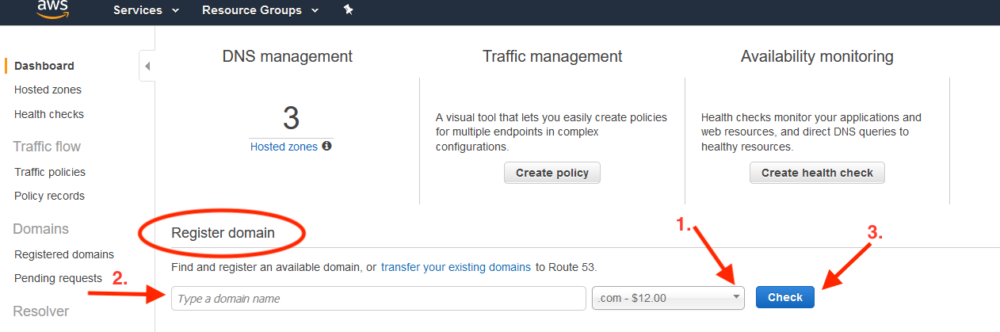
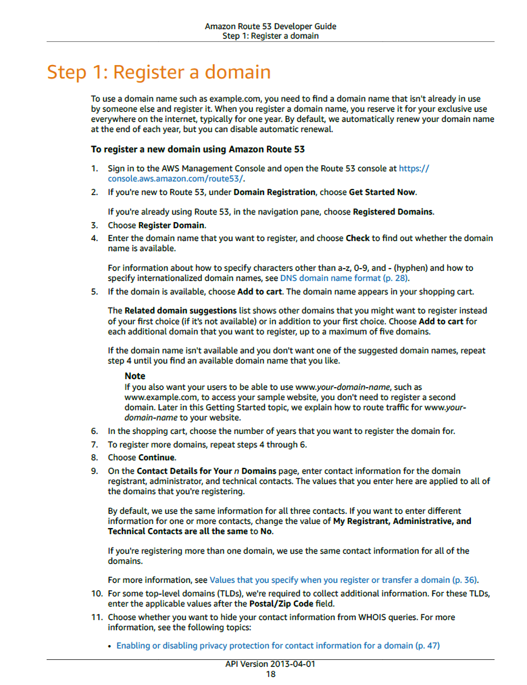
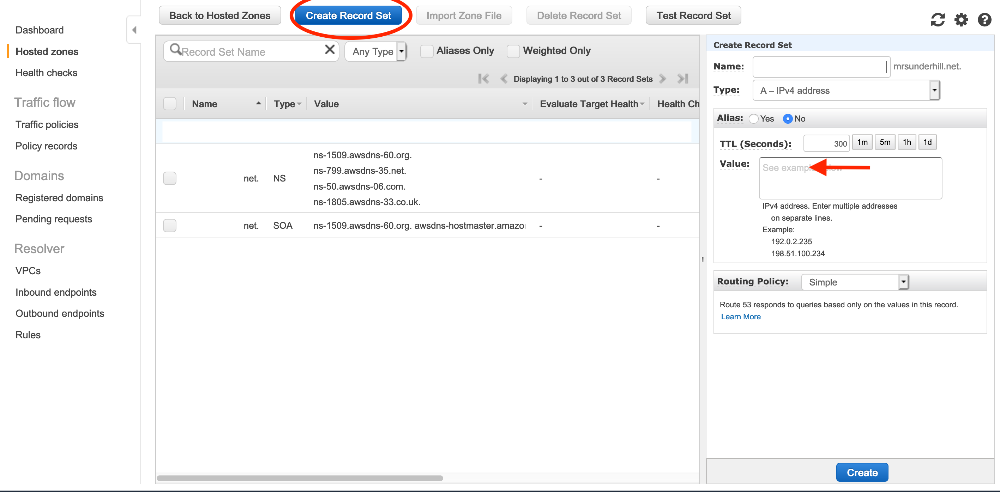

# Hosting a Private/Secure Jitsi-Meet Server on your home/small business network.

This is step by step instructions of how to host a security hardened dedicated Jitsi-Meet server at home. It is specific to a Ubiquity Edge x10 router and DNS registrar AWS (Amazon) Route 53.   However, the main contribution (automated Jitsi Meet and server hardening installation is independent of router and DNS registrar).

Most home networks do not have a static IP, however current practice of network providers seems to be to very infrequently change the IP (months), so it is practical to ignore that limitation and just update your domain name.

You will need a computer to act as a server.  It does not have to be fancy, but should have:
* Intel or AMD cpu (Jitsi-Meet does not work on ARM)
* Ethernet port.
* 8 GB of Memory.
* Keyboard and mouse.
* Monitor.
* USB memory > 16 GB stick to put Ubuntu ISO on (anything else on the stick will be lost).

It does not need a graphics card or wifi (best not to have wifi, but good luck finding a computer without it).  I favor Intel NUCs.   

One issue with using older hardware, is all of the hardware vulnerabilities that have been discovered (and exploits implemented) in the older CPUs, and you should keep your firmware up to date - older hardware firmware updates will likely be unsupported.

## High level overview of the process

1. Set up your Router to port forward to your server.
2. Acquire a Domain Name and assign it an IP.
3. Download recent Ubuntu 18.04 Server and put the ISO on the USB stick.
4. Install Ubuntu with specified Disk Partitions.
5. Install and automatically harden Jitsi Meet
6. Answer a few prompts.

### 1. Set up Router

Follow this linke for instructions for [Ubuiquity Edge Router](https://github.com/fgamgee/Jitsi-Meet-Secure-Server/blob/standalone/ubiquity_edge_setup.md).

### 2. Acquire a Domain Name and assign it your IP.


#### Make an AWS account for yourself.
(From Amazon AWS API Version 2013-04-01)

"When you sign up for AWS, your AWS account is automatically signed up for all services in AWS,
including Amazon Route 53. You are charged only for the services that you use.
If you don't have an AWS
account, use the following procedure to create one.
To create an AWS account
1. Open https://portal.aws.amazon.com/billing/signup.

2. Follow the online instructions.
*(Note - you should register for a personal account, basic plan, unless you are doing this for a business - and I have no experience with how that changes these instructions.)*

Part of the sign-up procedure involves receiving a phone call and entering a verification code.

#### Access the console

To access the AWS Management Console go to (https://aws.amazon.com/console/).  You probably want to bookmark this link, so you can get back to it.  


When you go for the first time, you will need to provide an email address and a password. Login as Root.
This combination of your email address and password is called your root identity or root account credentials. From the console, you can access the services, Route 53 (the AWS domain name registrar) and EC2 (where you launch instances).

### 2. Register a domain name (with Amazon Route 53).

#### Estimated cost

- *There's an annual fee to register a domain, ranging from $9 to several hundred dollars, depending on the top-level domain, such as .com. For more information, see [Route 53 Pricing](https://d32ze2gidvkk54.cloudfront.net/Amazon_Route_53_Domain_Registration_Pricing_20140731.pdf) for Domain Registration. This fee is not refundable.* (I recommend domain names ending in .net, they only cost $11 for the first year, are generally recognizable, and register quickly. Donaim names ending in unusual prefixes, _e.g._  ".be" names are sometimes cheaper, but can take much longer to process.)

- *When you register a domain, AWS automatically creates a hosted zone that has the same name as the domain. You use the hosted zone to specify where you want Route 53 to route traffic for your domain using an IP address (which you will get later). The fee for a hosted zone is $0.50 per month.*"

#### Steps
Click on this link [https://console.aws.amazon.com/route53/home](https://console.aws.amazon.com/route53/home)


_(Screen shot of what you will see as you follow steps below.  I recommend using the arrow 1. to choose .net instead of .com)_

and follow the steps below:




It is best to leave privacy enabled.

Disable "Automatic renewal of your domain" to prevent yearly charges. The option is right above the Terms and conditions. You can always change it to auto renew later.


After completing, you will see the screen below:


- Click on "Hosted zones" is the left column.


- Click the radio button next to the name of the hosted zone that matches the name of the domain that you want to route traffic for.


- Click **Go to Record Sets** (see red ellipse above).



- Choose **Create Record Set** (see red ellipse above)
 - Specify the following values:
 - **Name** – leave the box blank. The default value is the name of the hosted zone.
 - **Type** - Choose **A – IPv4 address**.
 - **TTL (Seconds)** (TTL stands for "Time To Live") - Accept the default value of **300**.
 - **Value** - Enter the IP address of your router under Allocate Elastic ID.
 - **Routing Policy** – Accept the default, **Simple**.
 - Click **Create** button at the bottom.


After you get an e-mail that your domain was successfully registered, you can ```nslookup domainname``` and make sure your IP has propgated to it. Receiving the registration e-mail usually takes 20 minutes with .net domain names but can take much longer (3 days).  If instead of getting a "successfully registered e-mail", you get an e-mail stating there are issues with your domain registration, follow the instructions in the e-mail to clear up the issues.  You might need to verify your e-mail, etc.  There is no point in proceeding until your domain is successfully registered.


### 3. Download Ubuntu 18.04.

### 4. Install Ubuntu with specified Disk Partitions.

Do a standard Ubuntu Server install, but when you get to the "Guided storage configuration" step, choose "Custom storage layout".


1. Partition 1 size 20 G (or larger) Format ext4 Mount /
2. Partition 2 Bootloader partition boot/efi - ESP fat32 size 512 M (automatically created)
3. Partition 3 size 5 G (or larger) Format ext4 Mount /home
4. Partition 4 size 10 G (or larger) Format ext4 Mount /usr
5. Partition 5 size 5 G (or larger) Format ext4 Mount /var
6. Partition 6 size 2 G (or larger) Format ext4 Mount /var/tmp
7. Partition 7 size 2 G (or larger) Format ext4 Mount /var/log
8. Partition 8 size 2 G (or larger) Format ext4 Mount /var/log/audit
9. Partition 9 size 64 G (or larger) Format SWAP

Do not install OpenSSH, do not install additional options, go ahead and apply security updates.

After the install, take your USB stick out and reboot.  On reboot, it will say no authorized SSH keys....  hit return, and enter your username and passwords.

### 5. Install and automatically harden Jitsi Meet

Type out the following commands one at a time (hit Enter and wait for each one to finish before running the next one) **change _master_ to _standalone_ if using development branch**
```
curl -o Install.sh https://raw.githubusercontent.com/fgamgee/Jitsi-Meet-Secure-Server/master/code/Install_standalone.sh
chmod +x Install.sh
script out.txt
sudo ./Install.sh
```
### 6. Answer a few prompts.

Once you start running the last command, a lot of text will start scrolling past on the screen. You will get a blue or pink screen – with a red **\<Yes\>** - press enter – **TWICE**.


Some more text, then you will get the message:
```
**Development releases of Ubuntu are not officially supported by this PPA, and uploads for those will not be available until Beta releases for those versions**
 More info: https://launchpad.net/~nginx/+archive/ubuntu/stable
Press [ENTER] to continue or Ctrl-c to cancel adding it.
```
Press **Enter**


More text will scroll – occasionally it will stop scrolling for a minute – be patient. If everything is going well you will get another bright pink or blue screen. **Type in your domain name and press enter.**

Almost immediately, another pink or blue screen will say **"Generate a new self-signed certificate …."** Press **Enter**. We will change this to a real certificate very soon.

More text…. Be patient. Next you will get a prompt:
```
Enter your email and press [ENTER]:
```
Enter the email address associated with your domain name and press **Enter**. This is sent to Let's Encrypt to obtain a security certificate.

Then lots more text. You may see a couple of  ```[WARNING]``` messages but that is normal. The Init AIDE task will also take several minutes, so be patient if it appears to hang.
Eventually you will see the message:
```
Username for host of meeting:
```
You need to enter a username for someone to host a meeting.  Type the username and press ENTER.  Then you will see:

```
Password:
```
Type in a password for the host to use when starting meetings and press **Enter**.  *Note, the password will *NOT* appear on the screen as you type.*

Installation is complete!

End Script.

```exit```
