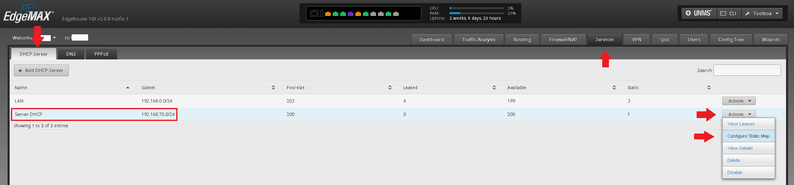
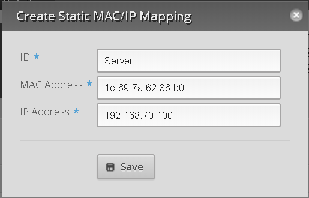

## Router Setup
When somebody attempts to connect to your Jitsi server, the data packets they send will first arrive at your router. By default, modern routers drop (throw away) packets they are unfamiliar with. In this section, we will configure your router to forward those packets on to your server instead.

We can't cover every router model here, so these instructions are for the Ubiquiti EdgeRouter series. You will need to adapt the router commands for your specific router model.

### 1. Create a separate network to isolate your server
_This is not strictly necessary for your server to work, but by doing so we can isolate your server to protect the rest of your network in case the server is compromised._

The idea is to create a separate network for a specific port on your router (which we will plug only the server into) and use the router's firewall to prevent that network from sending any data packets to your primary network (with the rest of your devices) or changing the router's settings.

Follow the video walkthrough here: https://www.youtube.com/watch?v=baj3747yfos Make sure to enable the DNS Server on the router, as described in the video - we will use it in step 2.b.

### 2. Setting up a static local IP for your server.
_This is not the same as the Elastic IP address you obtained from Amazon earlier if you set up a cloud Jitsi server._ This is an IP address valid ONLY on your local network.

### 2.a. Find your server's MAC address
This is an address that identifies your server to the router. We will need it in the next step so that we can tie a specific IP address to your server.

You can find it from the server's command line by following the tutorial here: https://linuxconfig.org/how-to-display-my-internal-ip-address-on-ubuntu-18-04-bionic-beaver-linux#h6-1-command-line

You will see a lot of gibberish. You are looking for a number that looks like this: **1c:69:7a:62:36:b0** - six pairs separated by single colons. It is **not**: 00:00:00:00:00:00, ff:ff:ff:ff:ff:ff, anything that looks like an IP address (ex. 127.0.0.1 or 192.168.70.23), or an IPv6 address (ex. fe80::db46:468e:e4cf:be5 - note the double colon at the beginning).

Write this MAC address down.

### 2.b. Assign a static local IP address to your server
_This is not the same as the Elastic IP address you obtained from Amazon earlier if you set up a cloud Jitsi server._ This is an IP address valid ONLY on your local network.

Head to the **Services** tab > **DHCP Server**, then find the network you set up earlier for the server. Hit the **Actions** drop-down at the left, and hit **Configure Static Map**:



This brings up a window that lets you configure how IP addresses are  assigned on this network. Click the **Static MAC/IP Mapping** tab, and note down the **Range start** and **Range End** addresses. Then click the **Create New Mapping** button.


Now choose a local IP address for your server. It doesn't matter what you choose as long as it is between the **Range start** and **Range End** addresses you noted earlier. (I chose 192.168.70.100.) Enter than IP into the **IP address** box. Then enter the MAC address you found in step 2.a. into the **MAC Address** box, including the colons. Finally, give this mapping a descriptive name in the **ID** box. (I chose "Server").



Hit **Save** and you are done. You should see the static map appear in the listing:


### 2.c. Verify your static IP assignment
Head back to your server and type

```sudo service network-manager restart```

to make the server request a new IP address from the router. Then run:

```hostname -I```

You should see the IP address you chose in step 2.b. (192.168.70.100 for me).

### 3. Create port forwarding rules
Port forwarding rules send traffic arriving at your router to the server.

Head to **Firewall/NAT** > **Port Forwarding** and look at the **Port forwarding rules** section (red box on picture). Hit **+ Add Rule** until you have space for 4 rules.

Fill in the 4 rules as shown in the picture. Make **Original Port**, **Protocol**, **Forward-to-port** exactly as shown. Description can be anything - it's just a name for the rule. **Forward-to-address** (green box) should be the local IP address you chose for the server in step 2.b. for every rule.

Then hit apply:


### 4. Configuring hairpin NAT/NAT loopback
_Optional. You can install the server without performing this step and come back to do this later if you need to. See step 4.c. for a test_

_This step only applies if you have other computers connected to the same router (i.e. behind the same NAT) that your server is connected to. Without this step, your server will work fine for everyone BUT those computers._

### 4.a. Find your network interfaces
Head to the **Interfaces** tab, then go to **DNS**. Look at the **Interface** section (red box). If you set up a secondary network for the server in step 1, you should see 2 entries. (If you have been setting up other networks for your own spurposes, you may see more.) Don't change anything, but note down the names of all the interfaces you see (**switch0** and **eth8** for me).


### 4.b. Set up hairpin NAT


Head back to **Firewall/NAT** > **Port Forwarding** and look at the top half of the page (red box). Make sure the **Enable hairpin NAT** button is checked. Make sure the **WAN Interface** drop-down (blue arrow) has the port number (ex. eth0 = port 0; eth8 = port 8) of your incoming Internet cable (the one that goes to the modem your ISP provided). Both of these are usually correct already.

Then, check that all the LAN interfaces you wrote down in the last step are listed (green box). If not, hit **Add LAN** (green arrow) and select the drop-down to add any missing interfaces. When you click on the drop-down, you will see many possible interfaces - do not add any of them except the ones you wrote down on the last step. (I only add **switch0** and **eth8**).

  <!--use html so we can set the size-->

### 4.c. Test hairpin NAT
_Do this **after** completing the install._

Try navigating to your domain (ex. example.net) from a browser on a computer connected to the router. If you get the router's login page instead of your server, you need to configure hairpin NAT.

To test if your server was set up correctly before you configure hairpin NAT, or if you are having difficulties configuring hairpin NAT, navigate to https://{server-local-ip} where the {server-local-ip} is the server's local IP address that you set in step 2.c.(ex. https://192.168.70.100 for me - NOT the Elastic IP address you obtained from Amazon if you set up a cloud server). The https:// part is important. You will get an "Invalid certificate warning" - bypass this and you should get a Jitsi Meet webpage.


Note the IP address in the address bar (red box).


